# Employee Management System

A comprehensive Employee Management System built with ASP.NET Core 8.0, designed to streamline HR operations and manage employee data efficiently.

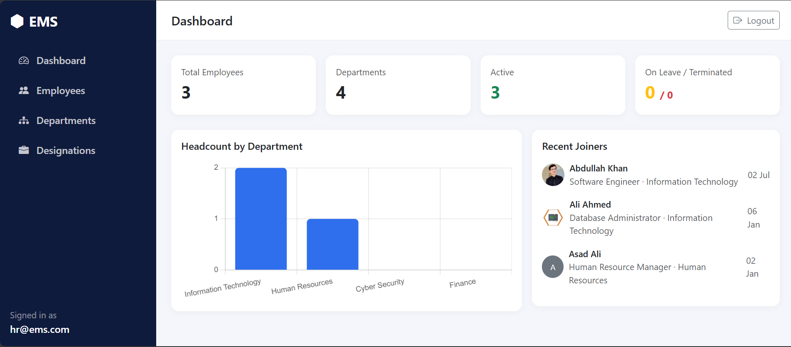

## 🌟 Features

### Core Functionality
- **Employee Management**: Add, edit, delete, and view employee records with detailed information
- **Department Management**: Organize employees into departments with unique codes
- **Designation Management**: Create and manage job titles/roles within departments
- **Authentication & Authorization**: Secure login system with role-based access control
- **Dashboard**: Overview of key metrics and statistics
- **Reporting**: Generate and export reports in PDF and Excel formats
- **Profile Photos**: Support for employee profile pictures

### Employee Information Tracking
- Personal details (name, email, phone, address, date of birth)
- Employment details (department, designation, salary, joining date)
- Employment status (Active, On Leave, Terminated)
- Profile photo upload

## 🛠️ Tech Stack

- **Framework**: ASP.NET Core 8.0 MVC
- **Database**: SQL Server with Entity Framework Core 8.0
- **Authentication**: ASP.NET Core Identity
- **PDF Generation**: QuestPDF
- **Excel Export**: ClosedXML
- **Language**: C# (.NET 8.0)

## 📸 Screenshots

### Login Page
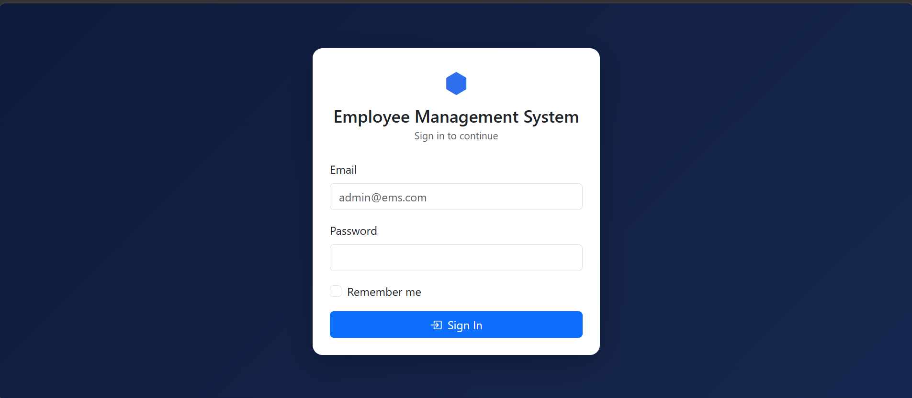

### Dashboard


### Employees List
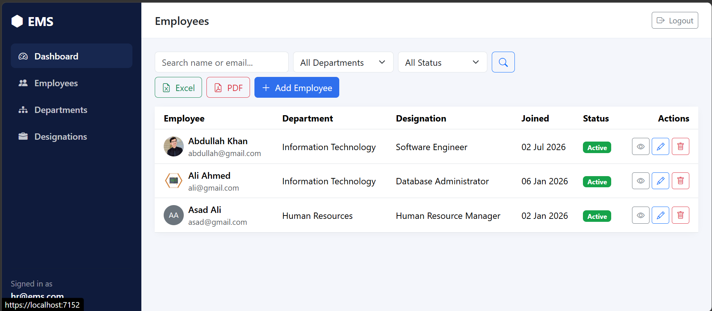

### Employee Details
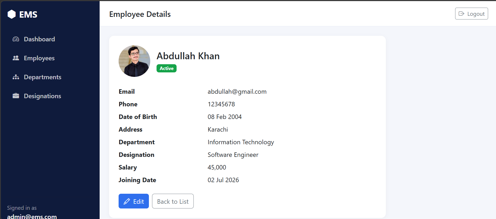

### Add Employee
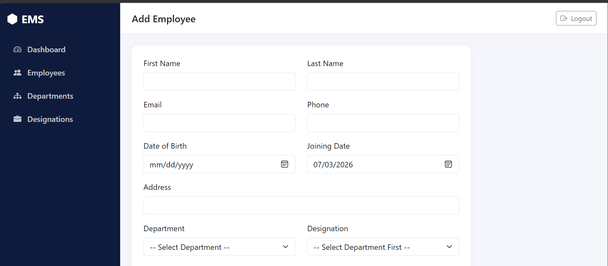

### Departments
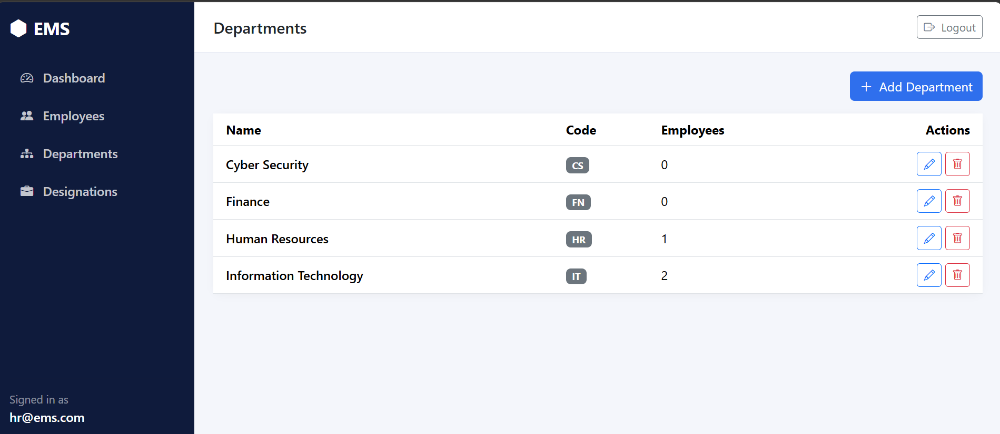

### Add Department
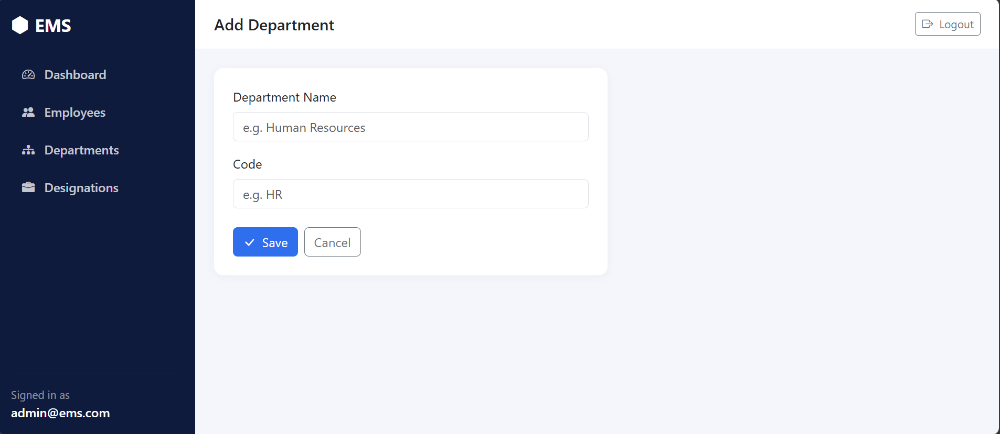

### Designations
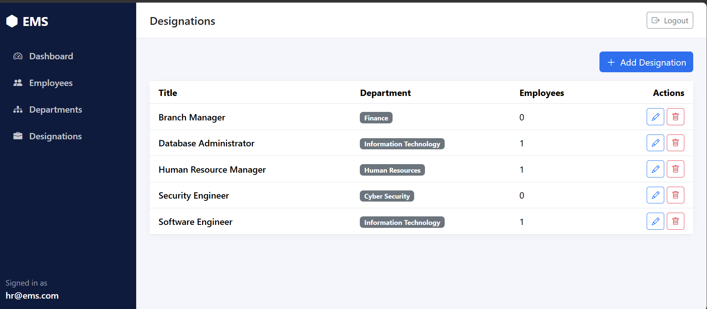

### Add Designation
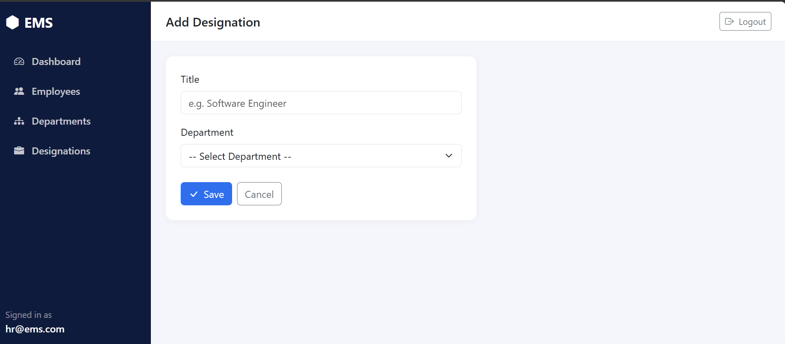

### Reports
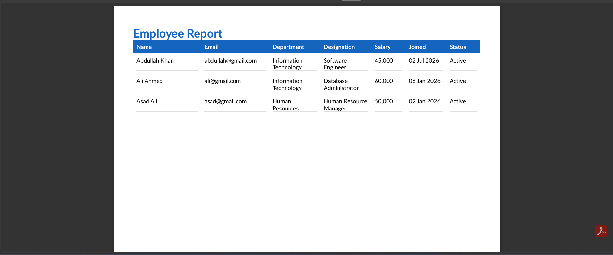

### Database Schema
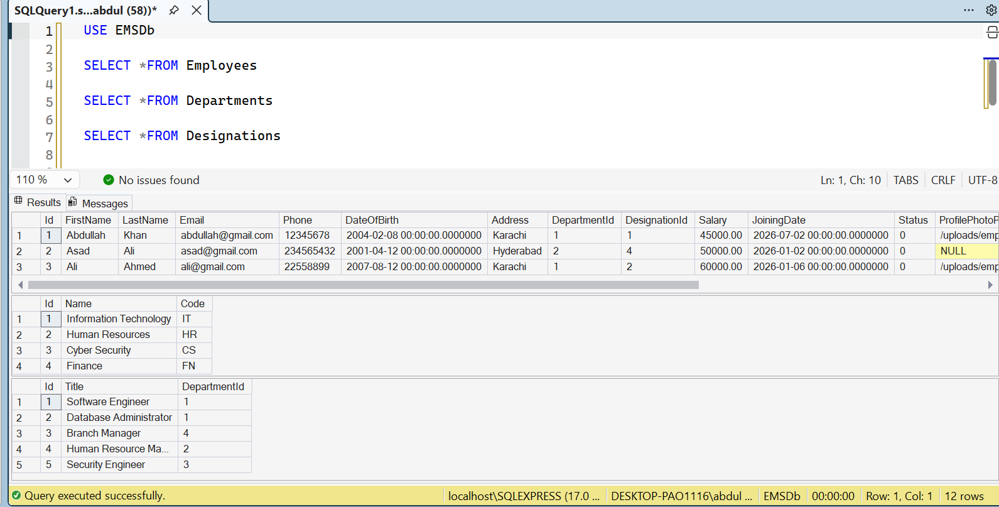

### Code Structure
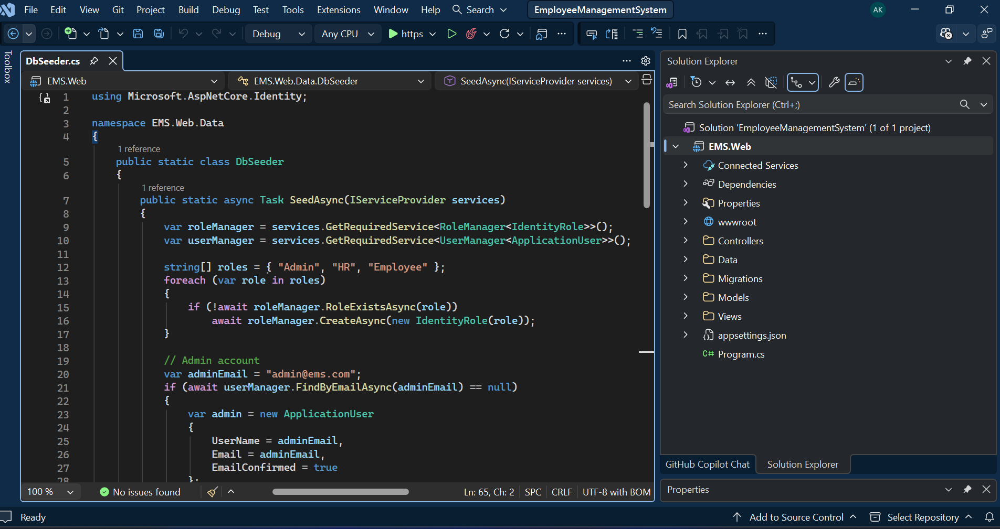

## 🚀 Installation

### Prerequisites
- .NET 8.0 SDK
- SQL Server (LocalDB or SQL Server Express)
- Visual Studio 2022 or VS Code

### Steps

1. **Clone the repository**
   ```bash
   git clone https://github.com/yourusername/EmployeeManagementSystem.git
   cd EmployeeManagementSystem
   ```

2. **Restore dependencies**
   ```bash
   dotnet restore
   ```

3. **Configure Connection String**
   
   Update the connection string in `EMS.Web/appsettings.json`:
   ```json
   {
     "ConnectionStrings": {
       "DefaultConnection": "Server=localhost\\SQLEXPRESS;Database=EMSDb;Trusted_Connection=True;MultipleActiveResultSets=true;TrustServerCertificate=True"
     }
   }
   ```

4. **Apply Database Migrations**
   ```bash
   cd EMS.Web
   dotnet ef database update
   ```

5. **Run the application**
   ```bash
   dotnet run
   ```

6. **Access the application**
   
   Open your browser and navigate to: `https://localhost:7001`

## 📖 Usage

### Default Admin Account
The application automatically seeds a default admin account on first run:
- **Username**: admin@ems.com
- **Password**: Admin@123

### Managing Employees
1. Navigate to the Employees section
2. Click "Add Employee" to create a new employee record
3. Fill in the required fields (marked with *)
4. Assign department and designation
5. Upload a profile photo (optional)
6. Click "Save" to create the employee

### Managing Departments
1. Go to Departments section
2. Click "Add Department"
3. Enter department name and unique code
4. Save the department

### Managing Designations
1. Navigate to Designations section
2. Click "Add Designation"
3. Select the department
4. Enter designation title
5. Save the designation

### Generating Reports
1. Access the Reports section
2. Select the report type (Employee List, Department Summary, etc.)
3. Choose export format (PDF or Excel)
4. Click "Generate Report"

## 🗄️ Database Schema

### Core Tables
- **Employees**: Stores employee information
- **Departments**: Organizational departments
- **Designations**: Job titles/roles
- **AspNetUsers**: User accounts for authentication
- **AspNetRoles**: User roles for authorization

### Relationships
- Department → Designations (One-to-Many)
- Department → Employees (One-to-Many)
- Designation → Employees (One-to-Many)
- Employee → ApplicationUser (Optional One-to-One)

## 📁 Project Structure

```
EmployeeManagementSystem/
├── EMS.Web/
│   ├── Controllers/          # MVC Controllers
│   ├── Data/                 # Database context and seeding
│   ├── Models/               # Domain models and ViewModels
│   ├── Views/                # Razor views
│   ├── wwwroot/              # Static files
│   ├── images/               # Screenshots and images
│   ├── Migrations/           # EF Core migrations
│   └── Program.cs            # Application entry point
└── README.md
```

## 🔧 Configuration

### Password Policy
Default password requirements (configurable in `Program.cs`):
- Minimum length: 6 characters
- No special characters required
- No uppercase requirement

### Database Configuration
Update connection string in `appsettings.json` to match your SQL Server instance.

## 🤝 Contributing

Contributions are welcome! Please follow these steps:

1. Fork the repository
2. Create a feature branch (`git checkout -b feature/AmazingFeature`)
3. Commit your changes (`git commit -m 'Add some AmazingFeature'`)
4. Push to the branch (`git push origin feature/AmazingFeature`)
5. Open a Pull Request

## 📝 License

This project is licensed under the MIT License.

## 👨‍💻 Author

**Your Name**
- GitHub: [@abdullahkhan-cs](https://github.com/abdullahkhan-cs)
- LinkedIn: [Abdullah Khan](https://linkedin.com/in/abdullah-malokani)

## 🙏 Acknowledgments

- Built with ASP.NET Core 8.0
- UI inspired by modern dashboard designs
- Icons and styling using Bootstrap 5

## 📞 Support

For support, email support@ems.com or open an issue in the repository.

---

**Note**: This is a demonstration project. For production use, ensure proper security measures, error handling, and performance optimizations are implemented.
